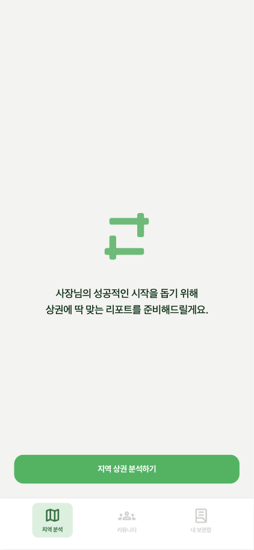
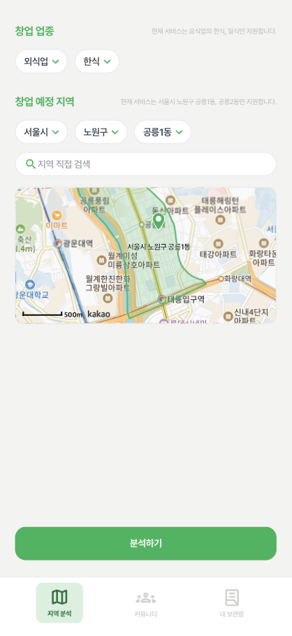
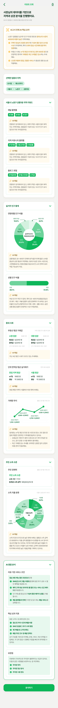

# 구석구석

**정성·정량 데이터를 한눈에! 예비 창업자를 위한 똑똑한 지역 상권 분석 서비스**

**An intelligent local commercial district analysis service for prospective entrepreneurs, providing both qualitative and quantitative data at a glance.**

---


## ✨ 주요 기능 (Key Features)

- **🗺️ 지도 기반 상권 탐색:** 사용자가 선택한 지역의 경계를 지도에 시각화하여 보여줍니다.
- **📊 자동 상권 보고서 생성:** 복잡한 과정 없이, 몇 번의 클릭만으로 맞춤형 상권 분석 보고서를 받아볼 수 있습니다.
- **📈 정성·정량 데이터 통합 분석:** 매출, 인구 등 정량적 데이터와 지역 커뮤니티의 리뷰, 소식 등 정성적 데이터를 결합하여 깊이 있는 분석을 제공합니다.
- **커뮤니티:** 예비 창업자들끼리 정보를 공유하고 소통할 수 있는 공간을 제공합니다.

---

## 🚀 Live Demo

**[➡️ 서비스 바로가기 (guseokguseok.site)](https://guseokguseok.site)**

---

## 🛠️ 기술 스택 (Tech Stack)


---

## 📂 프로젝트 구조 (Project Structure)

```
/
├── public/ # 정적 에셋
├── src/
│   ├── app/ # 라우팅 및 핵심 로직
│   ├── assets/ # 아이콘, 이미지 등
│   ├── components/ # 재사용 가능한 UI 컴포넌트
│   ├── data/ # 정적 데이터 (지역, 산업 등)
│   ├── hooks/ # 커스텀 훅
│   ├── mock/ # 모의 데이터
│   ├── pages/ # 페이지 컴포넌트
│   ├── styles/ # 전역 스타일
│   ├── types/ # 타입 정의
│   └── utils/ # 유틸리티 함수
├── package.json
└── README.md
```

---

## 📸 데모 & 스크린샷 (Demo & Screenshots)

**홈 화면**



**상권 분석**



**보고서**



---

## 🧑‍💻 팀원 (Team)

| 이름 (Name) | 역할 (Role) |
| :---------: | :---------: |
|   김민서    |  Frontend   |
|   홍석주    |  Frontend   |

---

## 📄 라이선스 (License)

This project is licensed under the MIT License.
